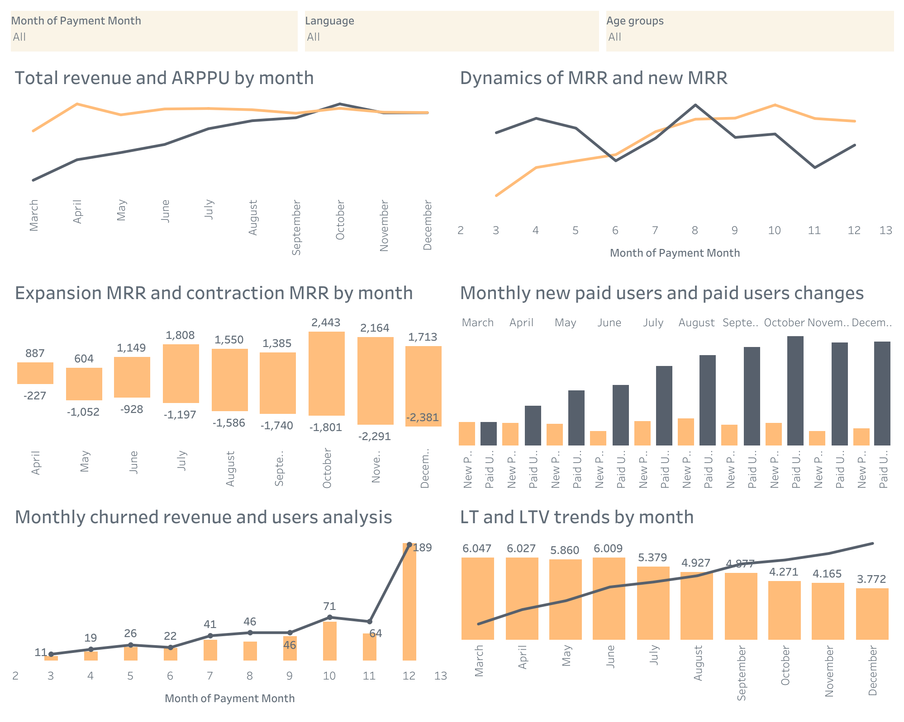

# Аналіз доходів від ігор

Цей репозиторій містить SQL запити для аналізу доходів від платних користувачів в ігрових проєктах, а також візуалізації, створені за допомогою Tableau. Використовується для оцінки таких показників, як MRR, ARPPU, churn rate, LTV та інших.

## Опис SQL коду

Використовуваний SQL код [revenue_metrics.csv](./revenue_metrics.sql) виконує наступні операції:
1. **Агрегує дані по місяцях**, обчислюючи загальний дохід та кількість платних користувачів.
2. **Обчислює регулярний дохід (MRR)**, включаючи показники для нових користувачів, відтік користувачів, приріст/скорочення MRR, а також показник довгострокової вартості клієнта (LTV).
3. Різноманітні обчислення для аналізу відтоку користувачів та доходів.

## SQL запит працює з наступними таблицями:

1. **games_payments.csv** — Дані про платежі:
   - `user_id`: Унікальний ідентифікатор користувача
   - `game_name`: Назва гри
   - `payment_date`: Дата платежу
   - `revenue_amount_usd`: Сума платежу (USD)

2. **games_paid_users.csv** — Дані про користувачів, які оплачують ігри:
   - `user_id`: Унікальний ідентифікатор користувача
   - `game_name`: Назва гри
   - `language`: Мова користувача
   - `has_older_device_model`: Чи має користувач старіший пристрій (`true`/`false`)
   - `age`: Вік користувача

## Результати аналізу

Результати аналізу збережені у файлі [results.csv](./data/results.csv). Цей файл містить наступні стовпці:

| Назва стовпця          | Опис                                                        |
|------------------------|-------------------------------------------------------------|
| `payment_month`        | Місяць, коли відбувся платіж.                               |
| `user_id`              | Унікальний ідентифікатор користувача.                       |
| `game_name`            | Назва гри.                                                  |
| `language`             | Мова користувача.                                           |
| `age`                  | Вік користувача.                                            |
| `total_revenue`        | Загальний дохід.                                            |
| `mrr`                  | Місячний регулярний дохід (MRR).                            |
| `paid_users`           | Кількість платних користувачів.                             |
| `arppu`                | Середній дохід на одного платного користувача (ARPPU).      |
| `new_paid_users`       | Кількість нових платних користувачів.                       |
| `new_mrr`              | Місячний регулярний дохід від нових користувачів.           |
| `churned_users`        | Кількість користувачів, які перестали платити.              |
| `churn_rate`           | Коефіцієнт відтоку користувачів.                            |
| `churned_revenue`      | Дохід, втрачений через відтік користувачів.                 |
| `revenue_churn_rate`   | Коефіцієнт відтоку доходів.                                 |
| `expansion_mrr`        | Приріст регулярного доходу.                                 |
| `contraction_mrr`      | Зменшення регулярного доходу.                               |
| `lt`                   | Тривалість користування продуктом (в місяцях).              |
| `ltv`                  | Довгострокова вартість клієнта (Lifetime Value).            |

## Візуалізація даних у Tableau

Цей розділ містить візуалізації, створені за допомогою **Tableau**, для аналізу доходів та метрик користувачів. Візуалізації забезпечують глибоке розуміння фінансових трендів і важливих показників, таких як доходи, відтік користувачів, та середній дохід на одного платного користувача.

### Доступні фільтри:
* Місяць: фільтрація даних за місяцями.
* Мова: фільтрація за мовою користувачів.
* Вікова група: фільтрація за віковими категоріями користувачів.

### Ось які графіки доступні у візуалізаціях:

1. **Total Revenue and ARPPU by Month:**  
   Графік, що показує загальний дохід та середній дохід на одного платного користувача (ARPPU) по місяцях.

2. **Dynamics of MRR and New MRR:**  
   Графік, що демонструє динаміку місячного регулярного доходу (MRR) і доходу від нових користувачів.

3. **Expansion MRR and Contraction MRR by Month:**  
   Графік, що відображає приріст і зменшення MRR по місяцях.

4. **Monthly New Paid Users and Paid Users Changes:**  
   Аналіз кількості нових платних користувачів та змін в кількості платних користувачів.

5. **Monthly Churned Revenue and Users Analysis:**  
   Графік відтоку доходу та користувачів по місяцях.

6. **LT and LTV Trends by Month:**  
   Тренди по тривалості користування продуктом (LT) і довгостроковій вартості клієнта (LTV) по місяцях.

**Візуалізація**

Нижче ви можете побачити зображення з календарем з Tableau:

Також ви можете переглянути інтерактивні візуалізації на [Tableau Public](https://public.tableau.com/views/Revenuemetrics_17371331066470/Revenuemetrics?:language=en-US&:sid=&:redirect=auth&:display_count=n&:origin=viz_share_link).

## Як запустити SQL код

1. Скачайте або клонуйте репозиторій.
2. Встановіть PostgreSQL або будь-яку іншу сумісну СУБД.
3. Імпортуйте дані з CSV файлів в базу даних.
4. Виконайте SQL запити для отримання результатів.
5. Імпортуйте результати у Tableau для створення візуалізацій.
